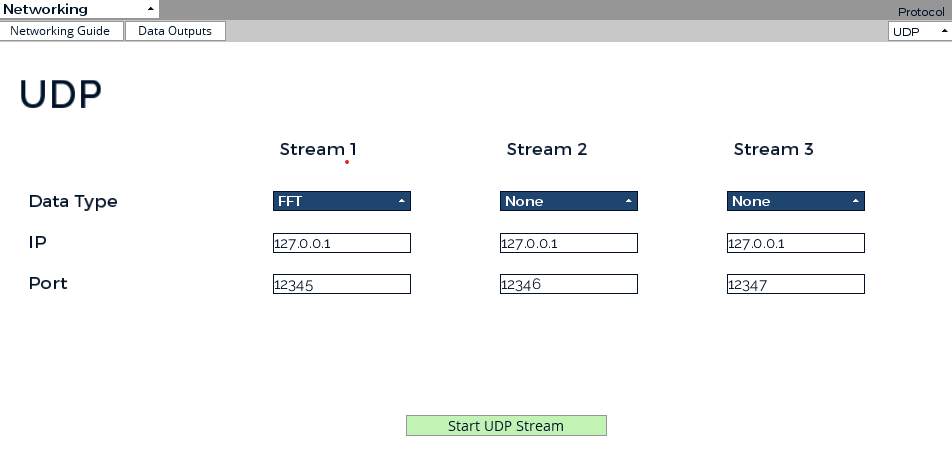
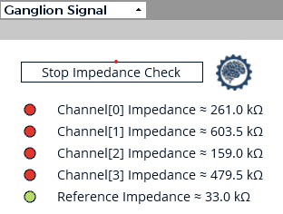
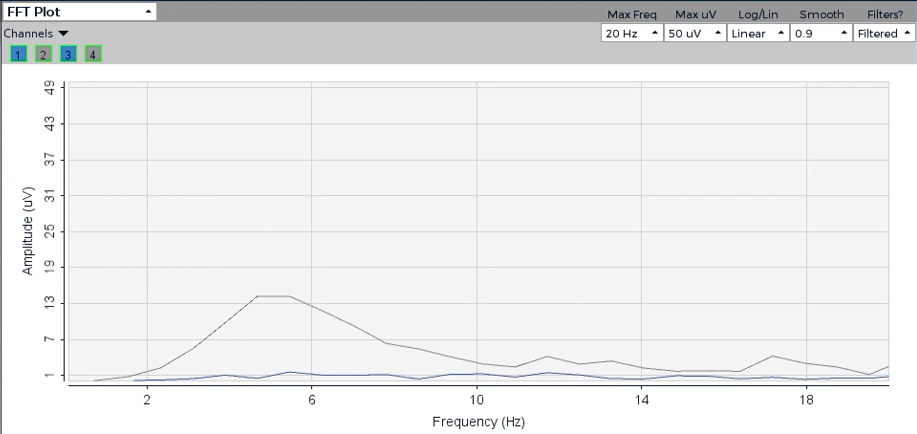
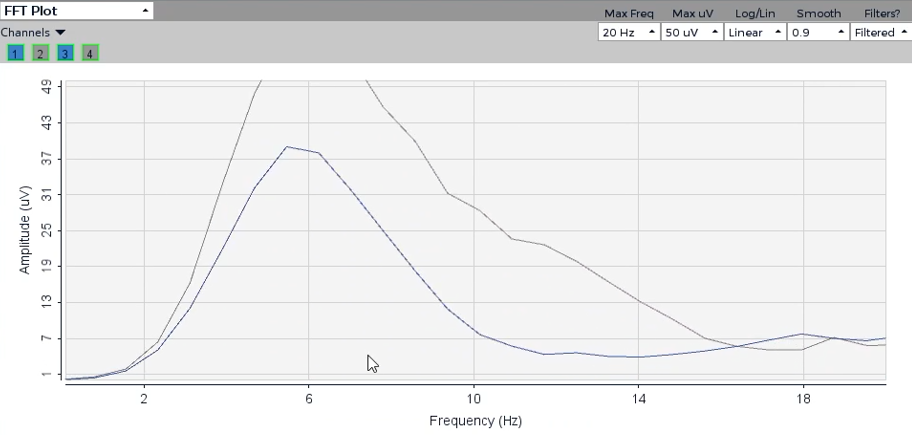

# Cosmic Crashout
Cosmic Crashout is a game that can be played by everyone, designed for quadriplegic individuals by utilizing the Open BCI EEG Headset. This project is made possible by PVNET Advanced Technology Center.

## Abstract
Cosmic Crashout is a Flappy Bird inspired game using Pygame and integrated EEG data inputs from the Open BCI GUI. This is one of a few games that work with the ganglion board from Open BCI.  
We allowed two inputs, blink and Hard-blink to select the options and play the game. 
Additionally, each of these keys are synced to the keyboard, so this game can also be played by keyboard. 
The global leaderboard creates a competative environment for everyone to compete for the score in top 5. 
This project demonstrates the integration of the neurofeedback mechanism in gaming, which highlights time potential for EEG-based controls in interactive applications. 

## Game Design (Frontend)
### Controls
| Actions      | Controls | Headsets
| ----------- | ----------- |----------- |
| Select      | Enter       | Hard Blink
| Next Option | Shift        | Blink
| Jump | Space        | Blink
| Ultimate | X        | Hard Blink

### Menu
We have multiple menus in this game 
#### Main Menu: First thing we see when running the "EEG_Game/main.py" file. 
- Selecting "Start" will lead you to Game Menu to play the game
- Selecting "Quit" will exit the game
- Selecting "Settings" will navigate you to various settings in the game

#### Setting: There are few features you can adjust
- Styles: Change the spaceship
- Ability: Choose the abilities
- Difficulty: Controls the speed and the spacing of the pole

#### Game Menu: 
- Play the game by utilizing the Jump and Ultimate

#### Game Over Menu:
- Selecting "Restart" will go back to Game Menu to play the game
- Selecting "Main Menu" will go back to the Main Menu
- Selecting "Record Score" will pull you to Record Score Menu

#### Record Score Menu: Allow you to input your initial to store the score on the global leaderboard
- Have A-Z and space as a character option
- We allow maximum of 3 character as your name
- Redirects you to the Main Menu after selecting all 3 characters

## Headset Setup Instructions
### Tools
- Open BCI GUI app
- Ganglion Board (Cyton Board will work too)
- Electrode Gel
- EEG Dongle

### Setting up Open BCI GUI
1) Launch Open BCI GUI and connect to the Ganglion Board
2) Check the Impedence as part of Setting Up Ganglion Board subsection (below)
3) Adjust the setting on FFT Plot
    - Filter only channel 1 and 3
    - Adjust the scale of the plot 
    - TIP: Make sure that these two plot is sitting under Amplitude of 8
 
4) Open Networking tab and copy the setting to click "start UDP Stream" 
 
5) Click "Start Data Steam" on the top left corner
6) Start playing the game!

### Setting up the Ganglion Board
We need total of 2 channels connected to Ganglion Board
 Tip: Chose the location where the impedence check is the lowest, adding Gel will improve impedence significantly.
- Channel 1: FP1 or FP2
- Channel 3: O1 or O2

Set up Noise Canceling and Reference by having clip on the ear 
Please Reference [Open BCI Documentation](https://docs.openbci.com/) for specific setups

Here is the Impedence we are working on. We are interested in channel 1(261.0) and 3 (159.0) 

## EEG Analysis (Backend)
EEG Analysis team first researched different controls that may be extracted for the game, but soon realized the limits from using Ganglion board which has fewer channels than the Cyton board. Because of EEG headset's nature of being influenced from the external factor such as electromagnetic waves, our team were having trouble recording data consistly. 
 After weeks of researching the best controls that can be used, we concluded that blinking is by far consistent and stable. 
 
 As you can see, whenever the subject blinks, FFT plot represent these as a concave indicating the high amplitude. From this mechanism, we decided to detect a blink whenever the amplitue first goes above 8 and when the average amplitude first starts increasing. 
 
 Similarily, hard blink is detected whenever the amplitude exceed 20 on the first channel and 5 on the third channel.
 
In order for the data to be extracted in real time, our team utilized UDP to recieve FFT data from Open BCI's GUI. 
We filter the frequencies to range from 4.8 to 17.6 and processed the corresponding amplitude. 
Once we detected the two controls, we synced them to the game to be played by the users.

## Background

## Aspects of improvement
One aspects of improvement is the number of controls. 

## Team Member
Ted Vegvari: Director of Research Development  
Jill Luna Nomura: EEG Data Analysis Lead, Open BCI Integration Development Lead, Leaderboard Management Integration  
Patrick McGrath: UI & Game strategy Development Lead, BCI Interface Integration & Accessibility Development, Open BCI Integration Development 
Joe Hubor: BCI Interface Integration & Accessibility Development Lead, UI & Game strategy Development, Quality Assurance Testor 2 
Tommy Nguyen: EEG Headset Electronic Integration, Visual & Asset Development, Quality Assurance Testor  
Joshua Nwabuzor: Visual & Asset Development, BCI Interface Integration & Accessibility Development 
Mark Segal: UI & Game strategy Development 
Mathias Gutierrez: Sound Design 

